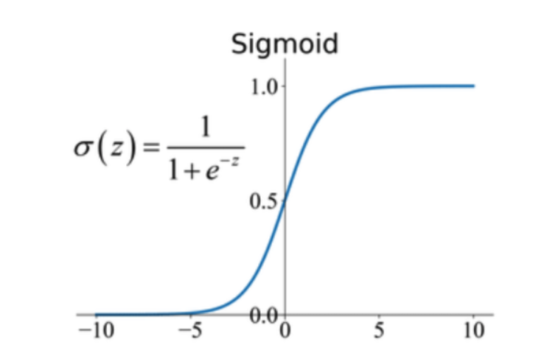

# Backpropagation Algorithm Implementaion by C

## [[Road Map]]
---

## 이론

**뉴런(neuron)**: 신경망의 가장 기본 단위, 이 뉴런은 여러 개의 입력(input)을 받아서 하나의 출력(output)을 내보내는 역할을 한다.

**<뉴런의 입/출력 과정>**
1. 입력들을 정보의 중요도(가중치)에 따라 합치는 단계
2. 합쳐진 신호를 '출력할지 말지', '얼마나 강하게 출력할지' 결정하는 단계

1)입력들을 정보의 중요도(가중치)에 따라 합치는 단계
- 뉴런이 2개의 입력, x1, x2를 받는다고 가정
- 가중치(weight) w1, w2를 곱함
- 활성화 기준인 편향(bias) b를 더함
입력 벡터: $X = [x_1,x_2]$
가중치 벡터: $W = [w_1,w_2]$
가중합(weighted sum): $z$ 
$$z = X \cdot W^T + b$$ 
$$ z = (x_1 \cdot w_1 + x_2 \cdot w_2) + b $$ 
**<활성화 함수의 역할>**
역할: "출력할지 말지" 결정하고, "신호를 얼마나 강하게" 할지 조절하는 것.

> 만약 활성화 함수가 없다면?
- 신경망은 그저 입력에 가중치를 곱하고 편향을 더하는 선형(Linear) 계산만 반복하게 된다. 층(Layer)를 아무리 많이 쌓아도, 그 전체는 결국 하나의 거대한 선형 계산과 다를 바가 없다.

활성화 함수는 이 선형적 계산 결과($z$)에 비선형성(Non-linearity)을  더해주는 역할을 한다. 덕분에 신경망은 훨씬 더 복잡하고 다양한 패턴을 학습할 수  있는 능력을 갖게 된다.

가장 대표적인 활성화 함수 중 하나로 시그모이드(Sigmoid) 함수가 있다.

### 순전파 과정 정리

1. **입력(x)과 가중치(w)로 가중합(z) 계산:**
	$z=(x1​w1​+x2​w2​+...)+b$
2. **가중합(z)을 활성화 함수(σ)에 통과시켜 최종 출력(a) 계산:**
	$a=σ(z)$

**<손실>**

$$ Loss = (y - a)^2$$
- 이 손실이 바로 신경망의 최종 성적표이다. Loss는 낮을수록 좋은 성능이다.

> 손실(Loss)를 줄이려면, 수많은 가중치와 편향을 '어느 방향으로', 그리고 '얼마나' 조절해야할까?
- 이 질문에 답을 찾는 것이 바로 역전파(Backpropagation)이다. 역전파는 기본적으로 '책임 전가' 시스템이라고 볼 수 있다.
1. 최적적으로 계산된 손실에서 시작한다.
2. 거꾸로, 출력층부터 한 단계씩 거슬러 올라가며 각 뉴런의 가중치와 편향이 이 최종 오차에 얼마나 기여했는지, 즉 '책임'을 계산한다.
3. '책임'이 큰 가중치와 편향은 더 많이 수정하고, 책임이 적은 것들은 조금만 수정한다.

이 '책임'을 수학적으로 계산하는 도구가 바로 미분(differentiation), 특히 여러 함수가 연결된 상황에서 사용하는 연쇄 법칙(Chain Rule)이다.

>가장 먼저 계산해야 할 것은 "손실(Loss)에 대한 예측값($a$)의 미분"이다. 쉽게 말해 "예측값이 아주 살짝 변할때, 손실 값은 얼마나 민감하게 변하는가?"를 알아보는 것이다.

### 최종 목표: 가중치(w)에 대한 손실(Loss)의 미분 값 구하기

우리의 목표는 손실 함수를 특정 가중치(w1​)로 미분한 값, 즉 $\frac{\partial Loss}{\partial w_1}$를 찾는 것입니다. 이는 w1​을 아주 조금 움직였을 때 전체 손실 값이 얼마나 변하는지를 의미하며, 이 값을 통해 가중치를 어느 방향으로 얼마나 업데이트할지 결정합니다.

---

### 1. 연쇄 법칙 (Chain Rule)

신경망은 여러 함수가 중첩된 구조이므로, 미분을 위해 연쇄 법칙을 사용합니다.

$${\frac{\partial Loss} {\partial w_1}} = {\frac{\partial Loss} {\partial a}} \cdot {\frac{\partial a} {\partial z}} \cdot {\frac{\partial z} {\partial w_1}}$$

이제 각 조각을 순서대로 살펴보겠습니다.

---

### 2. 각 조각 미분하기

#### ① 손실 함수 미분: ${\frac{\partial Loss}{\partial a}}$

- **손실 함수 (제곱 오차):** $Loss=(y−a)^2$
- **미분 과정:** Loss를 a에 대해 미분합니다. 연쇄 법칙에 따라 겉미분$(2(y−a))$과 속미분$((y−a)′=−1)$을 곱합니다.
- 결과:
$${\frac{\partial Loss}{\partial a}} = 2(y-a)\cdot(-1)=-2(y-a)$$

#### ② 활성화 함수 미분: ${\frac{\partial a}{\partial z}}$

- **활성화 함수 (시그모이드):** $a={\frac 1 {1+e^{−z}}}​$
- **미분 과정:** 복잡한 분수 미분 과정을 거치면, 놀랍게도 결과가 자기 자신($a$)으로 표현됩니다.
- 결과:
    $${\frac{\partial a}{\partial z}}​=a\cdot(1−a)$$
    

#### ③ 가중합 미분: ${\frac{\partial a}{\partial w_1}}$

- **가중합:** $z=(x_1​w_1​+x_2​w_2​+…)+b$
- **미분 과정:** $z$를 $w_1$​에 대해 미분합니다. $w1$​과 관련 없는 항$(x2​w2​,…,$b)$은 모두 상수 취급되어 0이 되고, $x1​w1​$ 항만 남아 계수인 $x1$​이 됩니다.
- 결과: $${\frac{\partial a}{\partial w_1}} = x_1$$
    

---

### 3. 최종 공식 조합하기

이제 위에서 구한 세 조각을 모두 곱하여 최종 공식을 완성합니다.

이것이 바로 예측값(a)과 정답(y), 그리고 입력값(x1​)만 알면 w1​의 그래디언트(기울기)를 계산할 수 있는 강력한 공식입니다.

이제 이 값을 이용해 **학습률(learning rate, α)** 이라는 작은 값을 곱해서 가중치를 업데이트하면 됩니다.
 
미분값은 손실이 가장 가파르게 '증가하는' 방향을 알려주므로, 우리는 그 반대 방향으로 가야 손실이 '감소'하기 때문에 빼주는 것이다.
